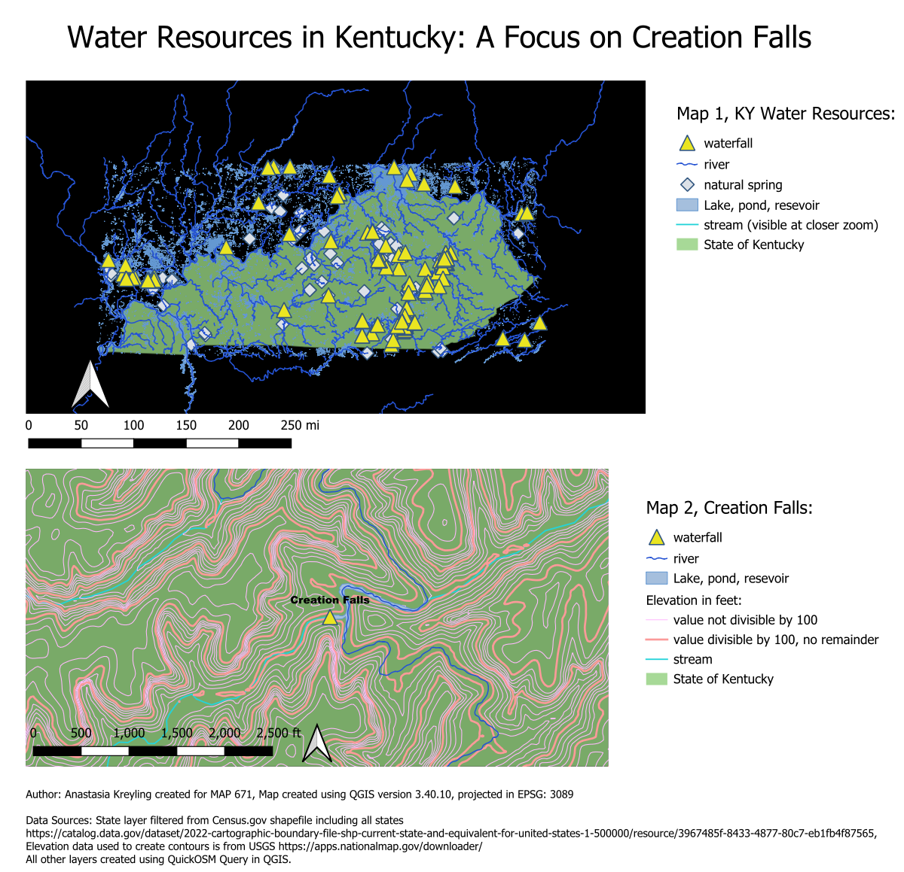

# Water Resources in Kentucky: A Focus on Creation Falls

The map created in this project features waterfalls, streams, springs, rivers, bodies of water, and the elevation contours of Creation Falls, located in the state of Kentucky. QuickOSM data, Elevation data from USGS, and downloaded data from the United States government was used.

Map was created on QGIS version 3.40.10. Layers were added using QuickOSM query in QGIS and additional layers were downloaded from the data sources below. Additional software used includes Visual Studio Code and GitHub. 

This project was authored by Anastasia Kreyling for the MAP 671 class at the University of Kentucky.

### Data Sources:

cb_2022_us_state_500k.shp shapefile downloaded from the U.S. Census Bureau TIGER Products [Link to data source: Cenus.gov](https://www.census.gov/cgi-bin/geo/shapefiles/index.php)   

GeoTIFF file of elevation contours near and around Creation Falls [Link to USGS Elevation Data](https://apps.nationalmap.gov/downloader/)

* Initial data projection: EPSG: 4326
* Final Map projection: EPSG: 3089, some layers may differ in their projection due to the file format.

### Project Background & Purpose:

The purpose of this map was to see the natural water resource and feature layout in Kentucky. Also, the location of waterfalls and springs was of interest to the author, specifically how they are distributed within the state. It was also of interest to find out how many waterfalls were in or around Kentucky. The author of the map has a particular interest in seeing either rivers, streams, lakes, and especially waterfalls when going on hikes. Seeing where these water resources are laid out could help other interested hikers in locating these sights of nature when choosing a trail. Additionally, for those who are interested in kayaking or canoeing, this map can assist with which streams and rivers are a potential route for them to take. The particular purpose of this map was to map out the elevation around Creation Falls, a waterfall found in the Red River Gorge. From the author's experience, the hike to Creation Falls is fairly easy, however, there are some hills along the route. Seeing and interpreting the Attribute Table of the elevation contour levels around Creation Falls can help others to prepare if they wish to slightly veer off course. All other waterfalls and springs featured on the map have name labels on them as well, visible at a particular zoom level, but only Creation Falls has the contour layer, mapping the elevation around it. 

The reason this map was created in QGIS instead of Mapbox was because the author wanted to see how much QGIS could do in comparison to Mapbox. The author had recently completed a map of an arch, Angel Windows, in Mapbox which provided great detail and a more "real" look to it. Mapbox also provides better symbols for points, which would have been great to have in QGIS to symbolize waterfalls, but the QGIS map still provides an accurate representation of water resources in Kentucky. QGIS also allows you to analyze and filter data a bit easier, which comes in handy when you are looking at specific locations. 

### Mapmaking Process & Methods:

1. Downloaded a shapefile for U.S states and added the layer to QGIS as a vector layer.
2. Filtered layer to Kentucky only, and exported the layer in GeoJSON fle format, EPSG 4326.
3. Set overall project to EPSG 3089. Additionally, made the background black in the project properties tab in order to put focus on Kentucky. 
4. Next added the natural features to the map through a query, only to the extent of the Kentucky layer. Go to vector-quickOSM to begin query.
5. Entered the key and value to find and explore various natural features to add to the map. 
6. Added waterfalls, streams, natural water, natural spring, and river. Chose the appropriate vector layer format to download (ex. points, polygons, etc.)
7. Dropped the unnecessary fields in each layer, about the first 12 from each, unless some of the layers didn't have that many to start with. This was done through the drop fields function found in the Processing Toolbox.
8. Exported and saved each layer as a Geopackage in EPSG 3089 and added to the map. Some of these layers were saved in the repository and others were saved in an external data folder in order to not exceed storage space.
9. Changed the layer's properties to make the symbols as appropriate as possible to what they are representing. Added name labels to the spring and waterfall points at a scale dependent visibility to the labels at 1:20000.
10. Added scale dependent visability to the streams. These steps were taken as to not overwhelm the map when zoomed out, but also to allow for a dimensional aspect because streams are small, and wouldn't be seen when zoomed out.
11. Downloaded the contour elevation data from USGS, specifically filtered to the coordinates of Creation Falls: Latitude, 37.769452 ; Longitude, -83.561758. Downloaded the Elevation Products (3D Elevation Program Products and Services) data in TIFF file format.
12. Added the raster layer in EPSG: 4269, clipped the extent to focus on and around Creation Falls. Removed the original layer and kept the clipped one. Additionally, used the Raster Calculator to convert the elevation units from meters to feet. Used the equation "Clipped (extent)@1"  *  3.281. 
13. Next I extracted the contours by going to Raster - Extraction - Contours. Set the interval between contour lines to 20 ft. 
14. Opened the attribute table on extracted contour lines and opened the field calculator. Added a new attribute to the table by identifying if a particlular value in that table is considered an index value. Used this equation  if(  "ELEV" % 100 = 0, 1, 0). This produced a new column that tells us if the value of a particular elevation is divisible by 100 with or without a remainder. This is noted in the legend of the map.
15. Exported the contour layer in Shapefile format at EPSG: 4326. This was saved in an external data folder due to the size of the shapefiles.
16. Made the contour lines at a scale dependent visability, and changed the style on them as well to categorized in order to distinguish between the two index values.
17. Created a map layout with zoomed out and zoomed in version. Added legend, metadata, title, north arrow, and scale. Exported at 2 resolutions: Web version: 1200 px width and High-resolution: 8000 px width. 
18. Edited the index.html file to include map information and linked it into the README file.  

### Map Summary & Map Image:

Here is a low resolution version of the map that features the zoomed out and zoomed in snapshots of Kentucky water resources. 

What I found is that Kentucky has a very intricate system of streams, rivers, and other bodies of water. The placement of waterfalls and springs is mostly along streams and rivers. Most of these waterfalls and springs are located in the Daniel Boone National Forest as well as the Red River Gorge. It also appears that some are near or around Lexington, KY as well as south of Lexington. The QGIS QuickOSM query function populated 139 waterfalls to the extent of the Kentucky state layer. To get a better look at the location of these waterfalls/springs you can enable the OpenStreet Map in QGIS. Something else you can notice from looking at the map is that most of the larger bodies of water appear just outside of the state lines, with mostly rivers and streams occuring inside Kentucky. Although there are some lakes in KY, such as Cave Run, it's mostly rivers/streams that populate the state. Lastly, I did not realize how many waterfalls and springs the state of Kentucky has until making this map, which was a great discovery. I am always searching for these features when going on hikes, and now I have a map where I can pinpoint the exact location of these features. Others who love water are welcome to use this map as a reference when planning hikes. 

Regarding the mapmaking process, I realized after completing this map that it would have looked a lot cooler and more detailed if I had used Mapbox. However, I wanted to test out and see how far I could go on QGIS. I would have liked better options to choose from for the symbology of the points and better topography filters for the polygon layers in order to give the map a more satelite appearance, but I did the best with what I was working with. There were some symbology downloads available when I researched, but I did not trust the safety of the websites or files. Those downloads didn't include symbols for waterfalls or natural springs either, so they weren't worth the risk. 

## Final Project Link:

You can download a higher resolution of the map by clicking the download link. <a href="Waterfalls-KY-highresolution.png" target="_blank">Download a full-screen version</a>

<a href="https://alkr227.github.io/Kentucky-waterfall-water" target="_blank">View Final Project Here</a>

